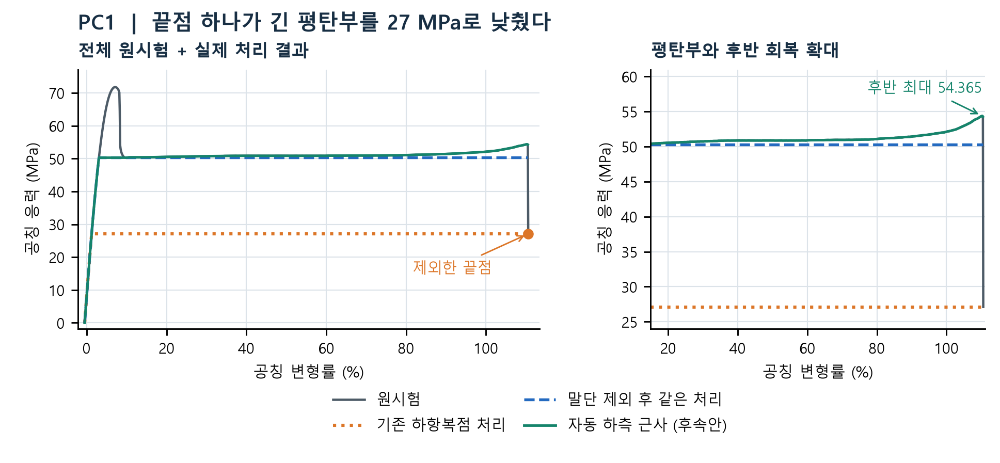
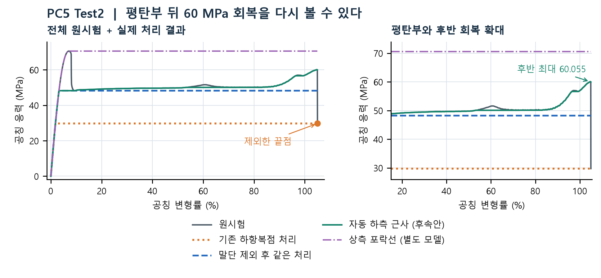
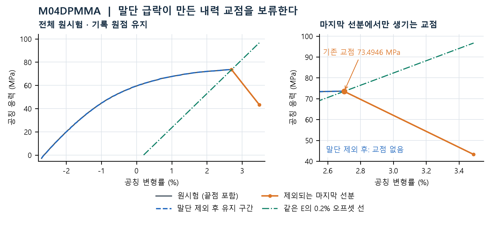
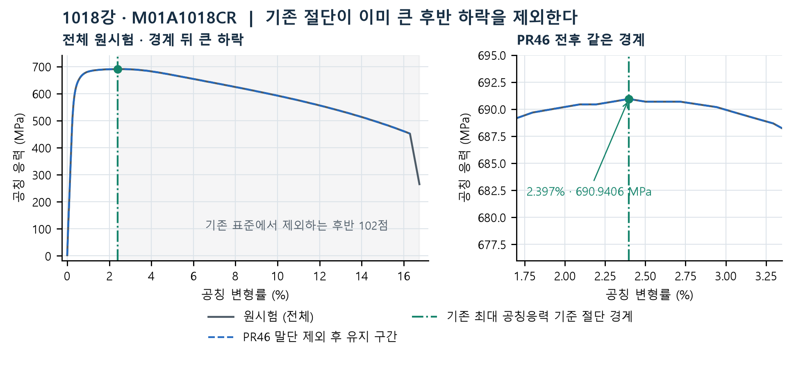
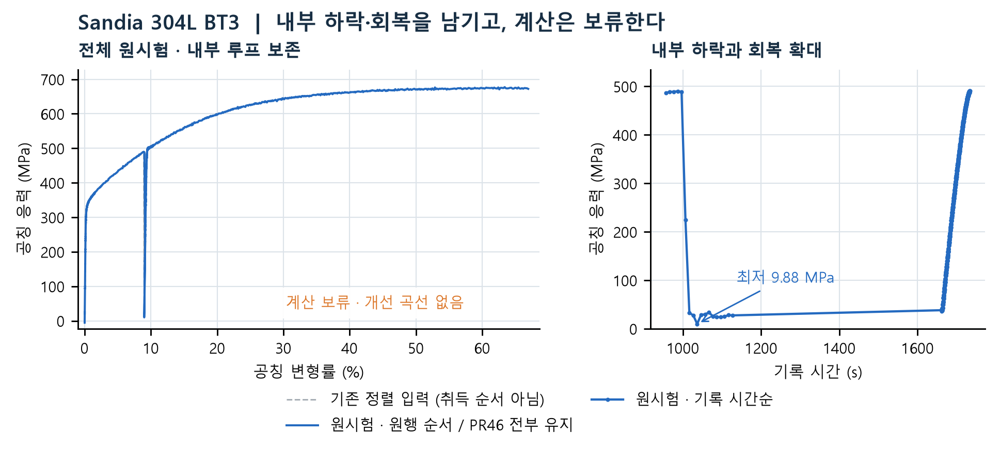

# 끝점이 바꾼 계산, 보존해야 할 시험 이력

실제 인장 시험 5개에서 전체 원곡선과 계산상 차이를 함께 비교했다. PC 두 사례는 긴 평탄부의 수준과 후반 회복, PMMA는 내력 교점, 1018강은 기존 절단 경계, BT3는 계산 보류 이유를 보여 준다.

PR46은 선택형 말단 제외 단계만 추가한다. 자동 하측 근사·상측 포락선·원행 순서 검증은 별도 후속 알고리즘이다. 아래 그림은 실제 함수 반환 배열이며, 전체 표준 레시피나 최종 물성카드의 전후 비교는 아니다. 전체 원곡선의 음수 변형률·말단·취득 순서를 보존했다.

## 1. PC1 — 끝점 하나가 긴 평탄부를 27 MPa로 낮췄다

**범위: PR46 + 후속 알고리즘**

왼쪽은 끝점까지 포함한 전체 원시험. 오른쪽은 평탄부와 후반 회복을 확대했다. 파란 선은 끝점만 제외한 같은 기존 처리라 후반까지 평평하고, 초록 선은 다른 알고리즘으로 회복 형상을 남긴다.  원자료: [Oxford PC Figure 5 · 50 mm/min · Test1](https://ora.ox.ac.uk/objects/uuid:01cf0db7-adcc-464e-9d04-3f4ccadee706)

**기존 결과**  전체 1,068점으로 기존 하항복점 처리를 실행하면 마지막 낮은 응력이 전 구간의 하한이 된다. 원시험의 봉우리 뒤 약 30% 응력 하락과 긴 평탄부가 27.105 MPa로 평탄화된다.

**변경 후 결과**  PR46으로 마지막 1점만 제외한 뒤 같은 함수·옵션을 다시 적용하면 평탄부가 50.2825 MPa로 올라간다. 별도 자동 하측 근사는 실측 평탄부를 따라가고 후반 54.365 MPa 최대도 남긴다.

**의미**  말단 제외는 낮은 끝점의 전역 영향을 제거한다. 후반의 완만한 회복을 남기는 효과는 후속 하측 근사의 효과다.

| 15~50% 변형률의 같은 관측 구간 | 응력 중앙값 (MPa) |
| --- | ---: |
| 원시험 | 50.78250 |
| 기존 하항복점 처리 | 27.10500 |
| 말단 제외 후 같은 처리 | 50.28250 |
| 자동 하측 근사 (후속안) | 50.77000 |

PC1·PC5는 논문의 공통 명목 ISO 527 1A 치수 80×10×4 mm(단면적 40 mm²)를 사용했다. 변형률은 크로스헤드 변위 / 80 mm로, 시편마다 측정한 국소 게이지 변형률이 아니다. 원 워크북 Figure5 Force-displacement.xlsx의 PC50Test1(50 mm/min)·PC5Test2(5 mm/min) 시험이다.

## 2. PC5 Test2 — 평탄부 뒤 60 MPa 회복을 다시 볼 수 있다

**범위: PR46 + 후속 알고리즘**

전체 그림에는 초기 봉우리, 긴 평탄부, 후반 회복과 마지막 급락을 모두 담았다. 확대 그림에서 초록 하측 근사와 보라 상측 포락선을 구별한다. 하측 근사도 후반 모든 점을 그대로 두지는 않는다: 95~104% 변형률 구간 56점을 최대 0.3425 MPa 수정했다.  원자료: [Oxford PC Figure 5 · 5 mm/min · Test2](https://ora.ox.ac.uk/objects/uuid:01cf0db7-adcc-464e-9d04-3f4ccadee706)

**기존 결과**  전체 2,017점의 기존 하항복점 처리는 끝의 29.730 MPa를 하한으로 삼는다. 원시험의 봉우리 뒤 약 32% 응력 하락, 평탄부와 후반 회복이 함께 낮아진다.

**변경 후 결과**  마지막 1점 제외 후 같은 처리는 48.2175 MPa가 되지만 후반도 평평하다. 후속 자동 하측 근사는 평탄부 49.540 MPa와 회복 형상, 실측 후반 최대 60.055 MPa를 남긴다.

**의미**  상측 포락선의 70.5575 MPa는 봉우리를 이어 가는 다른 모델 가정이다. 하측 근사의 추가 개선이나 실측 응력으로 해석하지 않는다.

| 15~50% 변형률의 같은 관측 구간 | 응력 중앙값 (MPa) |
| --- | ---: |
| 원시험 | 49.54375 |
| 기존 하항복점 처리 | 29.73000 |
| 말단 제외 후 같은 처리 | 48.21750 |
| 자동 하측 근사 (후속안) | 49.54000 |

PC1·PC5는 논문의 공통 명목 ISO 527 1A 치수 80×10×4 mm(단면적 40 mm²)를 사용했다. 변형률은 크로스헤드 변위 / 80 mm로, 시편마다 측정한 국소 게이지 변형률이 아니다. 원 워크북 Figure5 Force-displacement.xlsx의 PC50Test1(50 mm/min)·PC5Test2(5 mm/min) 시험이다.

같은 구간의 원시험 점 수: PC1 336점, PC5 672점. 기존 하항복점 처리와 말단 제외 후 같은 처리 두 행은 함수·옵션이 같고 말단 포함 여부만 다르다. 마지막 행은 같은 유지 입력에 적용한 별도 알고리즘이다.

## 3. M04DPMMA — 말단 급락이 만든 내력 교점을 보류한다

**범위: PR46**

전체 원시험의 기록된 음수 원점을 그대로 표시했다. 확대 그림의 오프셋 선은 같은 E로 정의한 σ=E(ε−0.002) 기준선이며, 주황 말단 선분의 교점은 유효 항복을 확인한 결과가 아니다.  원자료: [Illinois MTIL · M04DPMMA](https://files.mtil.illinois.edu/data/Courses/Fall%202026/ME%20330/Lab%2002%20-%20Tensile%20Stress%20and%20Strain/Section%2004/Tuesday_ME_Sec%204_3-5p_2026-09-15/M04DPMMA_1.csv)

**기존 결과**  131점의 원곡선에서 0.2% 오프셋 내력은 73.4946 MPa(변형률 2.70005%)로 계산된다. 교점은 마지막 급락 선분에서만 만들어진다.

**변경 후 결과**  마지막 1점 제외 후 E는 2.939721764 GPa로 정확히 같지만 유효 교점은 없다. 내력 값을 대체하거나 외삽하지 않고 보류한다.

**의미**  E 계산법 변경 사례가 아니다. 기존 프론트 표준에서도 내력 계산이 최대 공칭응력 기준 절단보다 먼저여서, 뒤에서 자르는 것만으로 이 교점을 없앨 수 없다.

## 4. 1018강 · M01A1018CR — 기존 절단이 이미 큰 후반 하락을 제외한다

**범위: 기존 처리 확인 + PR46**

전체 원곡선에서 큰 후반 하락은 기존 경계 오른쪽에 있다. 확대 그림의 같은 수직선은 '기존 최대 공칭응력 기준 절단 경계'이며, 물리적으로 검증된 네킹 시점이라는 뜻은 아니다.  원자료: [Illinois MTIL · M01A1018CR_1](https://files.mtil.illinois.edu/data/Courses/Fall%202026/ME%20330/Lab%2002%20-%20Tensile%20Stress%20and%20Strain/Section%2001/Monday_ME_Sec%201_8-10a_2026-09-14/M01A1018CR_1.csv)

**기존 결과**  기존 표준은 최대 공칭응력 기준 경계 뒤의 102점을 이미 제외한다. 경계는 원행 index 108, 변형률 2.397%, 응력 690.9406 MPa다.

**변경 후 결과**  PR46은 211점에서 마지막 1점을 제외하지만 같은 최대 공칭응력 경계는 변하지 않는다. E=201.8401 GPa와 내력 646.9481 MPa도 같다.

**의미**  이 정상 금속 사례는 새 개선 성과가 아니라 기존 처리의 확인이다. 원곡선·말단 유지 구간·경계 후보만 비교했으며, 재표본화를 포함한 표준 최종 배열의 일치를 주장하지 않는다.

## 5. Sandia 304L BT3 — 내부 하락·회복을 남기고, 계산은 보류한다

**범위: PR46 + 후속 알고리즘**

왼쪽의 파란 원행 곡선은 내부 루프까지 보존하고, 회색 점선은 기존 정렬 입력을 비교용으로 표시한다. 오른쪽은 하락·회복 구간을 기록 시간으로 확대한 원시험이다. 관측만으로 실제 찢어짐·재료 연화·장비 사건의 원인을 확정하지 않는다.  원자료: [Sandia · 304L stainless steel · BT3](https://doi.org/10.25452/figshare.plus.25483534)

**기존 결과**  2,587점 원시험에는 약 490 → 9.88 → 490 MPa의 내부 하락·회복과 이후 약 677 MPa 최대가 있다. 변형률이 감소하는 행 간격도 439개다. 변형률로 정렬하면 이 취득 이력이 섞인다.

**변경 후 결과**  PR46은 뒤의 회복을 보고 2,587점 모두 유지한다. 후속 하측 6방법과 상측 1방법의 직접 호출은 원행 순서의 변형률이 엄격히 증가하지 않아 모두 거절한다. 보류 뒤의 개선 곡선은 없다.

**의미**  기존 자동 E 계산도 실패했다. 기존 후속 전체 레시피 역시 사용 가능한 원자료 E가 없어 source_proof_stress 단계에서 보류했다. 새 순서 검증이 유효 카드를 처음 보류로 바꾼 사례는 아니다.

## 다른 사람에게 설명할 다섯 문장

| 사례 / 범위 | 실제 계산에서 달라진 점과 의미 |
| --- | --- |
| PC1 / PR46 + 후속 알고리즘 | 평탄부 27.105 → 50.2825 MPa; 후속 하측 근사 50.770 MPa |
| PC5 Test2 / PR46 + 후속 알고리즘 | 평탄부 29.730 → 48.2175 MPa; 후속안은 60.055 MPa 회복 최대 유지 |
| M04DPMMA / PR46 | 73.4946 MPa 교점 → 유효 교점 없음; E 그대로 |
| 1018강 · M01A1018CR / 기존 처리 확인 + PR46 | 기존 최대 공칭응력 경계 동일; 새 선행 제외 없음 |
| Sandia 304L BT3 / PR46 + 후속 알고리즘 | 전부 유지; 원행 순서 검증 7방법 거절, 기존 E 경로도 보류 |

재현: 기존 함수는 PR46 체크아웃 1b2adc4d(기존 코어 계보 503205ae), 후속 함수는 7c72413c에서 직접 실행했다. 기존 하항복점 처리는 sort_unique(mean), lower_yield, threshold=0.005, min_slope=0; 말단 정책은 terminal_loss_auto_v1이다. 후속 하측 근사는 같은 유지 배열에 band_and_events_auto_v2 / lower_envelope, 상측은 upper_envelope_auto_v1을 적용했다. E=auto, 오프셋=0.002. 원자료 시험 키·실행 옵션·정확한 수치·그림 배열은 case-summary.json에 있다.

해석 범위: 계산 근사의 차이와 보류 판단을 설명하는 보고서다. 물리적 항복·네킹·파단 원인, 시뮬레이션 물성·솔버 결과를 승인하지 않는다. PC의 전체 구간 하항복점 호출 결과는 기존 기본 레시피의 개선 효과와 구별해야 한다.

원자료: Oxford PC Figure 5(Test1·Test2), Illinois MTIL(M04DPMMA·M01A1018CR_1), Sandia 304L BT3. 상세 시험 키는 [case-summary.json](case-summary.json)에 기록했다.
