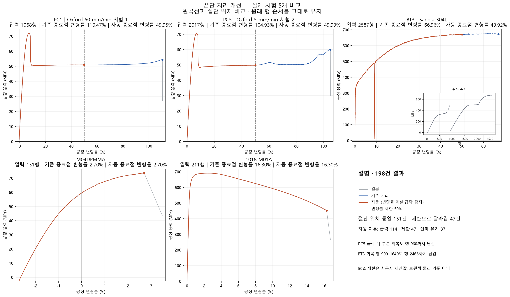

# 끝단 처리 개선 — 실제 시험 5개 비교

**상태: Draft.** 이 보고서는 저장된 198건 결과를 요약합니다. 첫 단계에서 하중–변위 자료(F–d)와 시편 초기 표점거리 L₀, 초기 단면적 A₀를 사용해 공칭 응력–변형률 곡선을 만듭니다. 이후 단계들은 변환된 곡선을 이어서 사용합니다. 끝단 처리는 공칭 변환 뒤·정렬 전에 실행하며, 원래 시험 행 순서를 그대로 두고 첫 행부터 절단 위치까지 남깁니다.

화면 선택지는 `자동 (변형률 제한·급락 감지)`와 `수동 (변형률 제한)` 두 가지이며, 과거 설정은 새 선택지에 포함하지 않습니다. 자동 처리는 변형률 제한으로 사용할 범위를 먼저 정하고 그 안에서 급락을 판정합니다. 급락 후보의 회복 여부는 제한으로 자르기 전 전체 원자료에서 확인합니다. 절단 위치는 급락 판정 기준을 충족한 위치와 변형률 제한 끝 중 더 앞선 곳입니다. 수동 변형률 제한의 기본값은 0.50이며, 0.50보다 큰 값도 지정할 수 있습니다. 결과에 포함한 마지막 행의 공칭변형률을 종료점 변형률로 표시합니다. 네킹 판단과 이후의 별도 곡선 자르기는 각각 다른 단계입니다.

## 실제 시험 5건

| 시험 | 입력 행 | 기존 처리에서 남은 행 | 자동 처리에서 남은 행 | 선택 이유 | 남긴 행 차이 |
| --- | ---: | ---: | ---: | --- | ---: |
| PC1 · Oxford 50 mm/min 시험 1 | 1,068 | 1,067 | 486 | 변형률 제한 50% | −581 |
| PC5 · Oxford 5 mm/min 시험 2 | 2,017 | 2,016 | 961 | 변형률 제한 50% | −1,055 |
| BT3 · Sandia 304L | 2,587 | 2,587 | 2,467 | 변형률 제한 50% | −120 |
| M04DPMMA | 131 | 130 | 130 | 급락; 기존 처리와 동일 | 0 |
| MTIL-M01A1018CR_1 | 211 | 210 | 210 | 급락; 기존 처리와 동일 | 0 |

전체 198건은 플라스틱 50건과 금속 148건입니다. 기존 처리와 절단 위치가 같은 시험은 151건, 변형률 제한에 따라 달라진 시험은 47건입니다. 자동 처리의 선택 이유는 급락 114건, 변형률 제한 47건, 전체 유지 37건입니다. 198건 모두 원래 행 순서에서 처음부터 절단 위치까지만 남았고, 입력 열과 단위도 그대로 유지했습니다.

PC5의 급락 뒤 부분 회복과 BT3의 909–1640행 회복 구간은 절단 위치 앞에 있어 남습니다. 이 하중 변화가 찢어짐이나 파단 때문에 생겼는지는 확인하지 못했습니다. 50%는 사용자가 제안한 모델링 제한이지 보편적인 물리 기준이 아닙니다. 이번 비교만으로 새 급락 판정이 실제 재료 모델에 더 적합하다고 입증된 것은 아닙니다.

## 추가 확인과 한계

- 수동 변형률 제한 0.30과 0.80은 검증 예시로 각각 3건에 적용했고, 총 6건 모두 지정값을 처음 넘는 행 직전까지 남았습니다. 0.80은 기본값이 아닙니다.
- 저장한 처리 설정을 다시 적용한 대표 3건은 결과가 모두 같았습니다.
- 기존 처리 비교는 현재 기존 계산 결과와의 비교입니다. R13/R15 기록에서 만든 독립 기준값과 비교한 것은 아닙니다.
- E, 항복강도, 재료 모델, 카드 자료 전체를 검증했다고 주장하지 않습니다.
- 첨부 결과: [간결 CSV](terminal-v2-concise.csv), [간결 요약 JSON](terminal-v2-compact-summary.json). 전체 검증 JSON은 작업 기록으로만 보관합니다.

## 개발 검증 상태

집중 테스트 36건, Ruff, mypy, 빌드가 통과했습니다. 이전 구현 커밋의 CI에서는 프론트 검사와 서버·워커·DB 구동 검사가 통과했습니다. 전체 테스트는 3,021 통과, 40 건너뜀, 2 실패입니다. 실패 하나는 백엔드 확장 규약 문서가 갱신되지 않은 점, 다른 하나는 선택 입력인 시간 열을 필수로 보는 단계별 입력 열 검사입니다. 플랫폼 개발자 소유 경로의 확인이 필요해 이 PR은 Draft 상태입니다.

## 화면 확인

PC1 화면에서 `자동 (변형률 제한·급락 감지)`는 0부터 세어 485행까지 포함해 486행을 남겼습니다. `수동 (변형률 제한)`의 0.80 검증 예시는 773행까지 포함해 774행을 남겼습니다. 이 한 사례에서 두 설정의 E 1.527 GPa, 0.2% 오프셋 항복강도 60.53 MPa, 네킹 후보 0.07138은 같았습니다. 한 사례의 화면 확인이며 E 전체를 검증한 것은 아닙니다. 화면 선택지는 자동과 수동 두 가지입니다. 끝단 처리는 공칭 변환 뒤·정렬 전에 있고, 네킹 판단과 별도 곡선 자르기는 뒤에서 따로 합니다. 별도 곡선 자르기를 켠 화면의 최종 300행은 끝단 처리에서 남긴 486행 또는 774행과 다릅니다.

화면에 시간 열이 있었지만 단위가 `1`로 표시되어 초 단위 시간으로 사용하지 않았습니다. 대신 변형률이 엄격히 증가하는지를 진행 순서로 사용했습니다. 원자료와 단위는 바꾸지 않았고 새 처리 결과도 저장하지 않았습니다.
